# Cattle Tracking System — Embedded Systems Project


## Table of Contents

- [Motivation](#motivation)
- [Overview](#overview)
- [Key Features](#key-features)
- [Repository Structure](#repository-structure)
- [Hardware Design](#hardware-design)
  - [Tracker Board (Collar Node)](#tracker-board-collar-node)
  - [Base Station Board](#base-station-board)
- [Firmware](#firmware)
  - [Tracker Firmware](#tracker-firmware-firmwarefirmware-tracker)
  - [Base Station Firmware](#base-station-firmware-firmwarefirmware-base-station)
- [Communication Protocol](#communication-protocol)
- [Dashboard Application](#dashboard-application-dashboard-app)
- [Technology Stack Summary](#technology-stack-summary)
- [Academic Context](#academic-context)
- [Author](#author)

---

## Motivation

My father is a farmer. Every single day he drives out to the field to walk the land, check on the animals, make sure they are healthy and in the right paddock. It is a time-consuming routine that depends entirely on being physically present.

That got me thinking: what if I could apply my knowledge as an engineering student to make his daily work easier? With a satellite tracking system he could simply pull out his phone, check an app, and know the status of every animal in real time — without leaving the house.

That question became this project. For the *Programación de Sistemas Embebidos* course I decided to build a **low-power, long-range embedded solution** that tackles exactly that problem. The result is a working prototype: custom PCBs, bare-metal firmware, a LoRa radio link, and a web dashboard, all built from scratch.

The system is still a prototype and has room to grow in several areas, but it is **fully functional** — and with a reasonable amount of additional development it could be deployed in a real field environment without any fundamental obstacles.

---

## Overview

An end-to-end **IoT solution for GPS-based livestock tracking** built entirely from scratch — custom PCBs, embedded firmware, and a web dashboard included.

The goal was to design a **low-power, long-range** monitoring system that can be attached to cattle collars. Each collar (tracker node) periodically collects GPS coordinates and body temperature, and transmits this data wirelessly to a fixed base station using **LoRa radio modules**. The base station forwards all received data to a PC, where a web application stores and visualizes it in real time.

```
┌─────────────────────────────────────────────────────────────────┐
│                         FIELD                                   │
│                                                                 │
│  ┌──────────────┐       LoRa        ┌──────────────────────┐   │
│  │   Tracker    │ ────────────────► │    Base Station      │   │
│  │  (Collar)    │ ◄──────── ACK/CFG │  (Fixed / Fencepost) │   │
│  │              │                   │                      │   │
│  │ STM32F103    │                   │ STM32F103            │   │
│  │ GPS (u-blox) │                   │ USB CDC              │   │
│  │ DS18B20 Temp │                   └──────────┬───────────┘   │
│  │ SX127x LoRa  │                              │               │
│  └──────────────┘                              │ USB Serial    │
│                                                │               │
└────────────────────────────────────────────────┼───────────────┘
                                                 │
                                    ┌────────────▼──────────────┐
                                    │     Dashboard App (PC)    │
                                    │   FastAPI + SQLite + Web  │
                                    └───────────────────────────┘
```

---


<p align="center">
  
</p>

## Key Features

- **GPS tracking** — latitude, longitude, satellite count and heading, with 0.0001° precision
- **Temperature monitoring** — DS18B20 sensor with 0.001 °C resolution
- **Battery voltage monitoring** — reported in millivolts
- **LoRa radio link** — long-range, low-power wireless communication (SX127x modules)
- **Two operating modes** — Continuous (every 30 s) and Low-Power (configurable interval with GPS pre-warming)
- **Reliable delivery (Stop-and-Wait ARQ)** — every DATA frame is acknowledged; unacknowledged frames are retried
- **Remote reconfiguration** — the base station can push configuration changes (mode, interval, GPS timers) via piggybacked ACK frames
- **Persistent configuration** — node settings survive power cycles (stored in Flash)
- **CRC16-CCITT integrity checks** — every frame is verified on both ends
- **Comprehensive error reporting** — 16-bit error mask covers GPS fix failures, sensor errors, battery alerts, and radio issues
- **Web dashboard** — real-time visualization of all received telemetry; debug view with raw frame inspection

---

## Repository Structure

```
EmbeddedSystemProyect/
├── firmware/
│   ├── firmware-tracker/          # STM32 firmware for the collar node
│   │   ├── Core/
│   │   │   ├── Inc/               # Header files
│   │   │   └── Src/               # C source files
│   │   ├── Drivers/               # STM32 HAL + CMSIS
│   │   └── EmbeddedSystemProyect.ioc
│   └── firmware-base-station/     # STM32 firmware for the base station
│       ├── Core/
│       │   ├── Inc/
│       │   └── Src/
│       ├── Drivers/
│       ├── Middlewares/           # USB Device stack (CDC)
│       └── Base_station.ioc
├── hardware/
│   ├── kicad/
│   │   ├── tracker-board/         # KiCad schematic + PCB for the collar
│   │   └── base-station-board/    # KiCad schematic + PCB for the base station
│   └── images/
│       ├── tracker-boad/          # Schematics, renders, and photos — tracker
│       └── base-station-board/    # Schematics, renders, and photos — base station
└── dashboard-app/                 # Python FastAPI web application
    ├── app/
    │   ├── api/                   # REST endpoints
    │   ├── db/                    # SQLAlchemy models + SQLite session
    │   ├── proto/                 # Frame parser + CRC16
    │   ├── serial/                # Serial port reader (USB CDC)
    │   └── web/                   # Jinja2 templates (dashboard, debug, mode)
    └── requirements.txt
```

---

## Hardware Design

Both boards were designed from scratch in **KiCad**, manufactured, hand-assembled, and tested.

### Tracker Board (Collar Node)

The tracker is a compact, battery-powered board designed to be mounted on a livestock collar. It integrates the microcontroller, LoRa module footprint, GPS connector, temperature sensor interface, and power management in a single PCB.

**Schematic**

<p align="center">
  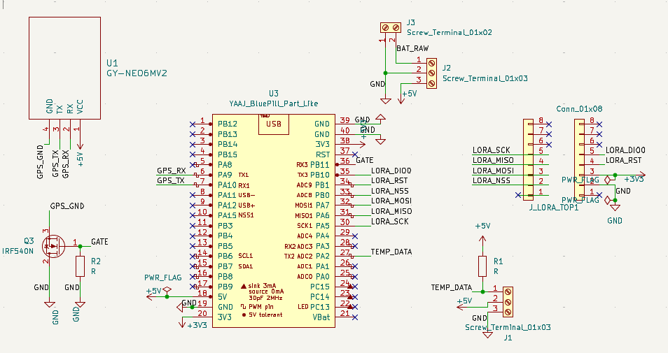
</p>

**PCB Layout**

<p align="center">
  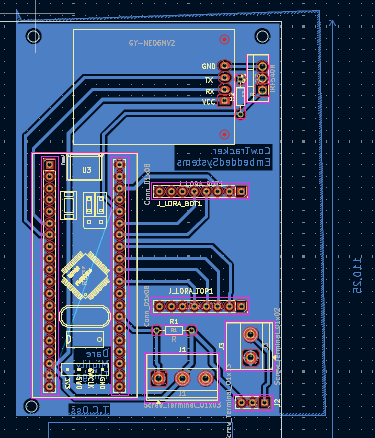
</p>

**3D Renders**

| Front | Back |
|-------|------|
| 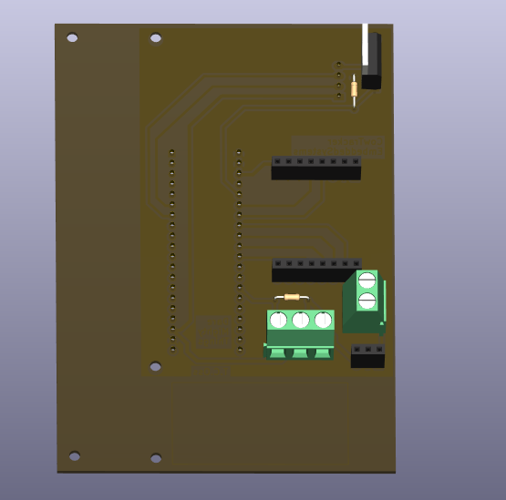 | 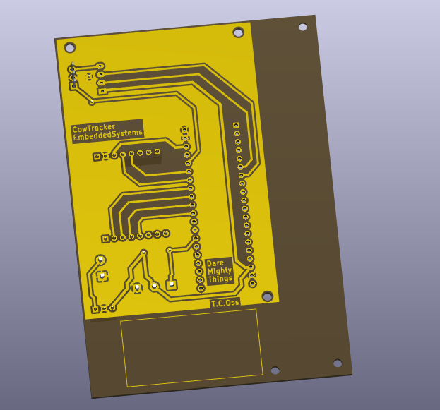 |

**Fabrication & Assembly**

<p align="center">
  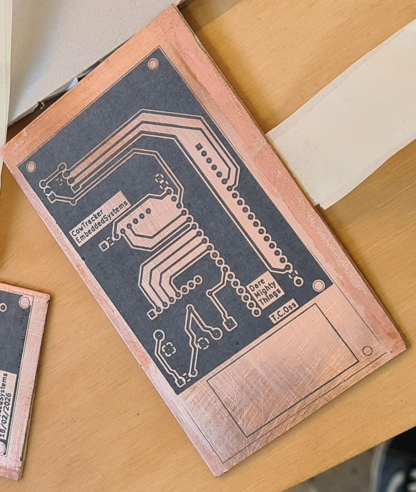
  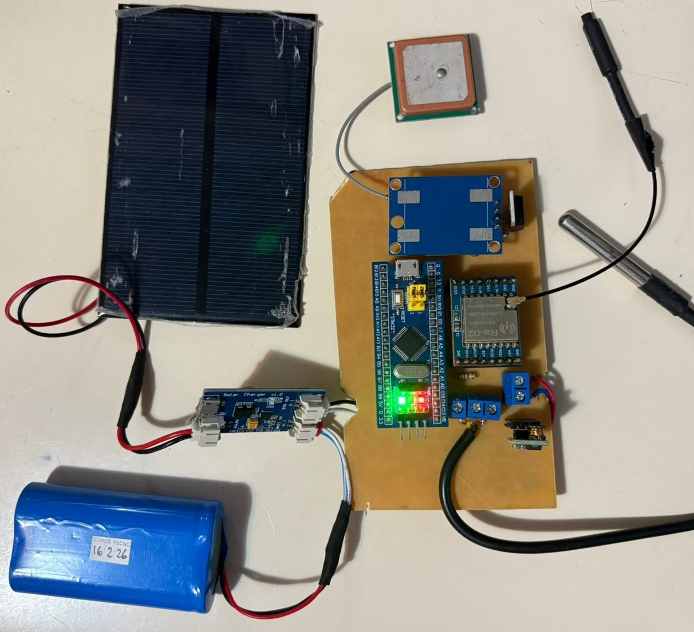
</p>

**Mounted on Collar**

<p align="center">
  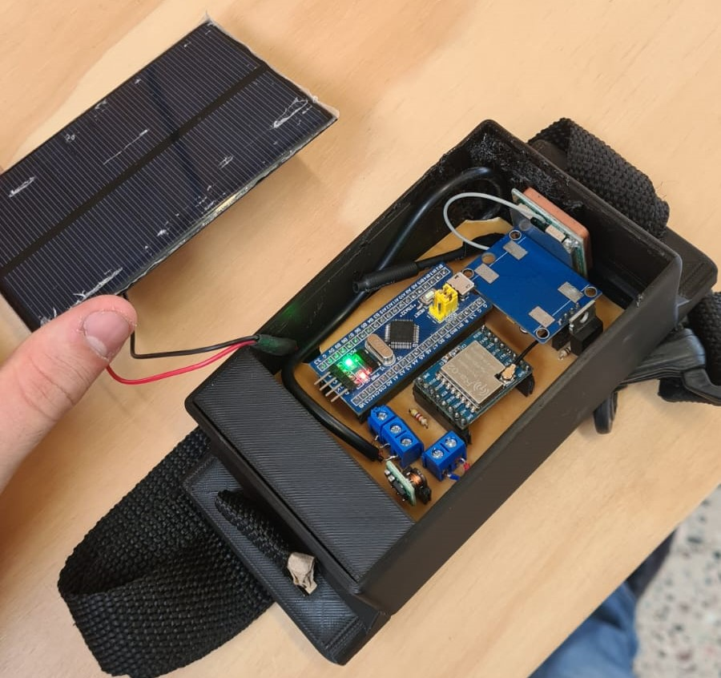
  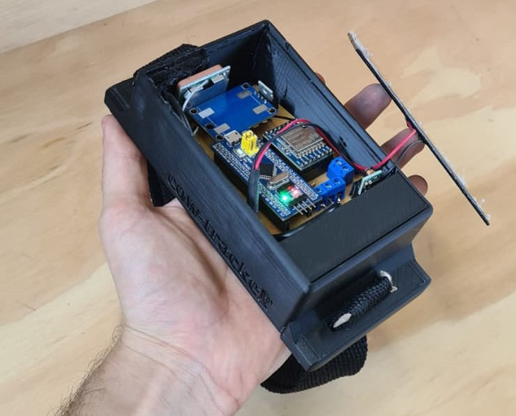
</p>

<p align="center">
  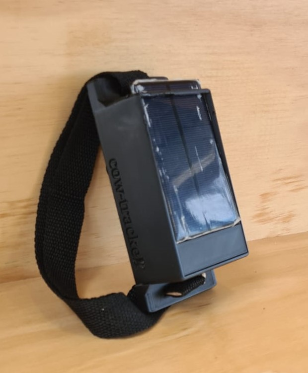
  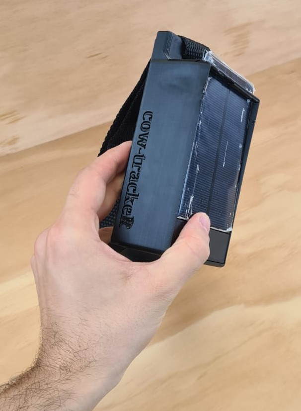
</p>

---

### Base Station Board

The base station is a fixed-installation board. It receives LoRa frames from all trackers in range and forwards the raw data to a PC over USB (CDC virtual serial port).

**Schematic**

<p align="center">
  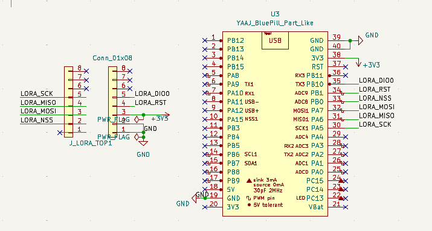
</p>

**PCB Layout**

<p align="center">
  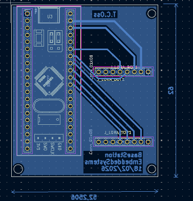
</p>

**3D Renders**

<p align="center">
  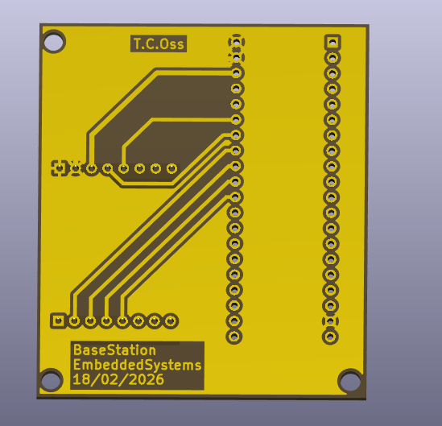
  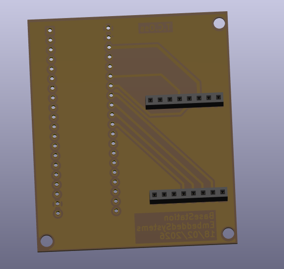
</p>

**Fabrication & Result**

<p align="center">
  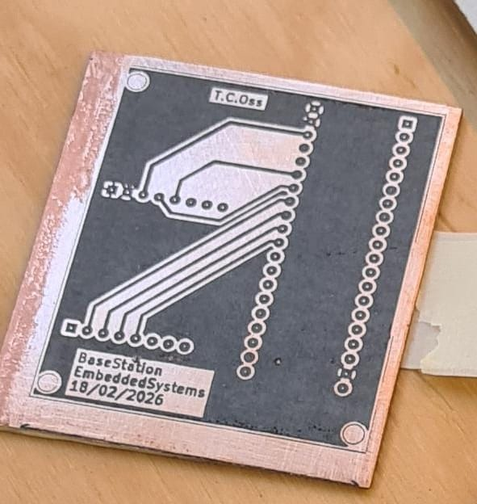
</p>

<p align="center">
  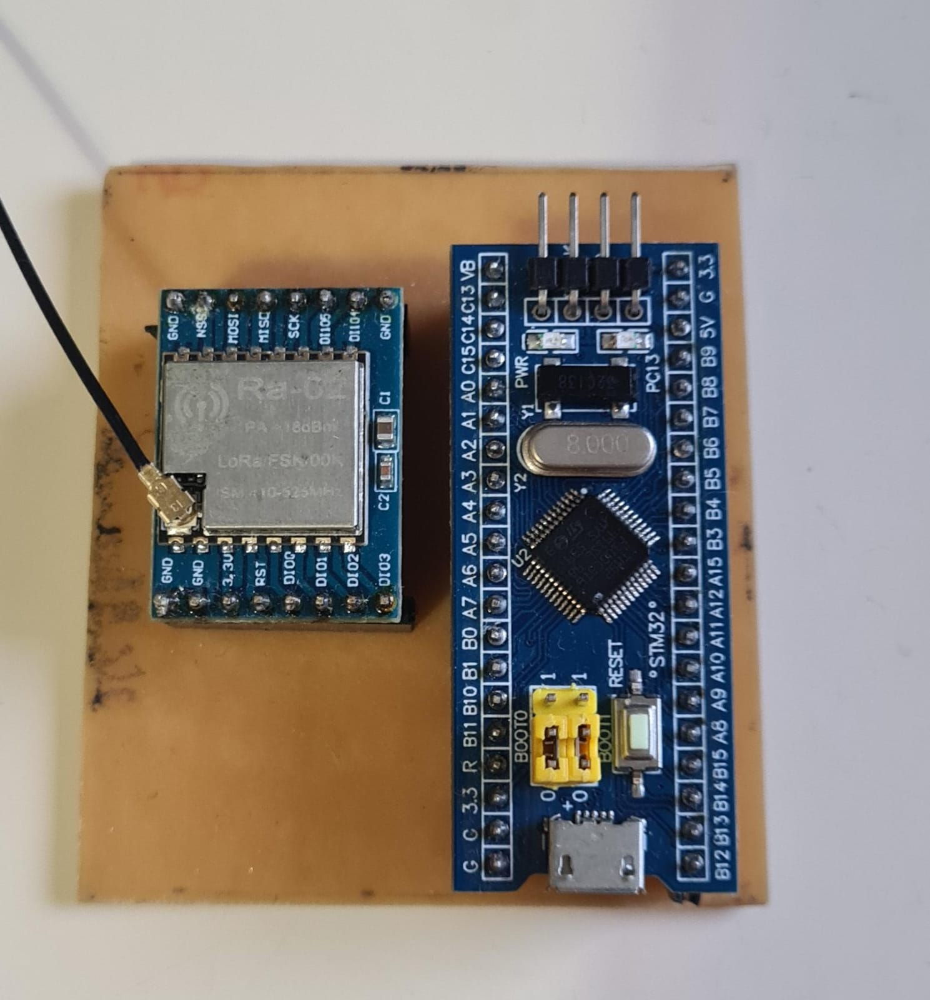
  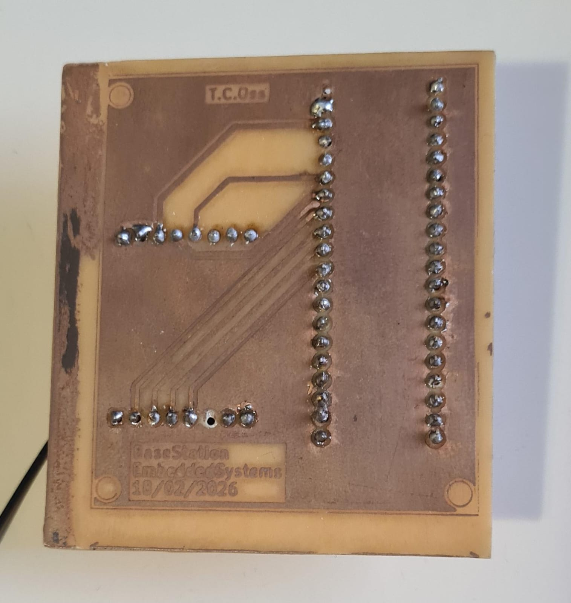
</p>
---

## Firmware

Both firmware projects target the **STM32F103C8T6** (ARM Cortex-M3, 64 KB Flash, 20 KB RAM) and were developed using **STM32CubeIDE**. 

### Tracker Firmware (`firmware/firmware-tracker`)

The tracker firmware follows a clean layered architecture:

```
┌─────────────────────────────────────────┐
│          Application Layer              │  node.c — NodeSimple_Task()
│  (mode management, data collection,     │  node_cfg.c — Flash persistence
│   TX scheduling, RX window)             │
├─────────────────────────────────────────┤
│           Service Layer                 │  gps.c — NMEA / UBX parser
│  (sensor acquisition, GPS management,  │  service_temp.c — DS18B20 service
│   temperature, battery)                 │
├─────────────────────────────────────────┤
│          Protocol Layer                 │  frame.c — pack/unpack frames
│  (framing, CRC16, ARQ link layer)       │  crc16_ccitt.c
│                                         │  node_link.c — Stop-and-Wait ARQ
├─────────────────────────────────────────┤
│       Hardware Abstraction Layer        │  LoRa.c — SX127x SPI driver
│  (LoRa radio, OneWire, UART, SPI, GPIO) │  ds18b20.c + onewire_uart.c
│                                         │  STM32 HAL (SPI1, USART1/2, GPIO)
└─────────────────────────────────────────┘
```

#### Peripheral Mapping

| Peripheral | Pins | Purpose |
|-----------|------|---------|
| SPI1 | PA5 / PA6 / PA7 | LoRa SX127x data bus (SCK / MISO / MOSI) |
| GPIO | PB0 / PB1 / PB10 | LoRa NSS (chip-select) / RST / DIO0 (IRQ) |
| USART1 | PA9 / PA10 | GPS UART @ 9600 baud (NMEA + UBX) |
| GPIO | PB11 | GPS power enable |
| USART2 | PA2 (half-duplex) | OneWire bus for DS18B20 @ 115200 baud |
| GPIO | PC13 | Status LED |
| SWD | PA13 / PA14 | Programming interface |

#### Operating Modes

**Continuous Mode (`NODE_MODE_CONTINUOUS`)**
Transmits a DATA frame every 30 seconds with the GPS running continuously. Prioritizes update frequency over power consumption — suitable for short-duration operations or testing.

**Low-Power Mode (`NODE_MODE_LOW_POWER`)**
Designed for multi-day battery life. The GPS is kept off between transmissions. Before each scheduled TX, the GPS is powered on for a configurable pre-warm period (`gps_prewarm_s`) to start acquiring satellites. An additional wait (`gps_extra_wait_s`) is allowed to obtain a valid fix. After transmission, the GPS is powered down again.

Both modes and their timing parameters are configurable and persist across reboots in **Flash memory** (last 1 KB page at address `0x0800F800`).

#### Reliable Delivery (Stop-and-Wait ARQ)

After each DATA frame is transmitted, the node opens a **receive window** waiting for an ACK from the base station. If no ACK is received within the timeout, the frame is retried up to `n_retries` times. The ACK frame can optionally carry a `CFG` payload, allowing the base station to push updated configuration to the node without a separate control channel.

#### Initialization Sequence

```
HAL_Init() → SystemClock_Config()
  → MX_GPIO_Init()
  → MX_USART1_UART_Init()  (GPS @ 9600 baud)
  → MX_USART2_UART_Init()  (OneWire / DS18B20 @ 115200 baud)
  → MX_SPI1_Init()         (LoRa @ 8 Mbit/s)
  → GPS_Init()
  → TempService_Init(&huart2, DS18B20_RES_10BIT)
  → LoRa_init()            (retried up to 50 times)
  → NodeSimple_Init(lora, node_id=1, net_id=0x27)
  → while(1) NodeSimple_Task()
```

---

### Base Station Firmware (`firmware/firmware-base-station`)

The base station is simpler by design. Its responsibilities are:

1. Continuously listen on the LoRa channel for incoming DATA frames
2. Send an ACK frame back to the transmitting node (optionally with a CFG payload)
3. Forward received frames to the PC over **USB CDC** (virtual serial port)
4. Accept commands from the PC (`pc_cmd.c`) to push configuration changes to specific nodes

It exposes a USB CDC virtual COM port to the host PC, over which raw received frames (prefixed with RSSI) are streamed. The dashboard app reads this serial stream.

---

## Communication Protocol

All LoRa transmissions use a custom binary framing protocol with CRC integrity verification.

### Frame Structure

```
 ┌──────────────────────────┬────────────────────┬───────────────┐
 │       HEADER (8 bytes)   │  PAYLOAD (variable) │  CRC16 (2 B)  │
 └──────────────────────────┴────────────────────┴───────────────┘

Header fields:
  [0] VER    — Protocol version (0x01)
  [1] NET    — Network ID (0x27 by default)
  [2] TYPE   — Message type
  [3] SRC    — Source node address
  [4] DST    — Destination address (0xFF = broadcast)
  [5] SEQ    — Sequence number (0–255, wraps around)
  [6] FLAGS  — Validity bits (GPS_VALID | TEMP_VALID | BATT_VALID)
  [7] PLEN   — Payload length in bytes
```

### Message Types

| Type | Code | Direction | Description |
|------|------|-----------|-------------|
| DATA | `0x10` | Tracker → Base | Sensor telemetry payload |
| ERR  | `0x11` | Tracker → Base | Error notification with text |
| ACK  | `0x30` | Base → Tracker | Acknowledgment (may carry CFG) |
| CFG  | `0x20` | Base → Tracker | Remote configuration update |

### DATA Payload (27 bytes)

```c
typedef struct {
    uint32_t t_ms;            // Node uptime in milliseconds
    uint32_t utc_raw_x1e3;    // UTC time from GPS (x1000)
    int32_t  lat_raw_x1e4;    // Latitude  ddmm.mmmm x 10000 (negative = S)
    int32_t  lon_raw_x1e4;    // Longitude dddmm.mmmm x 10000 (negative = W)
    uint8_t  sats;            // Number of satellites in view
    uint16_t course_cdeg;     // Heading in centidegrees (degrees x 100)
    int32_t  temp_mC;         // Temperature in milli-Celsius
    uint16_t batt_mV;         // Battery voltage in millivolts
    uint16_t err_mask;        // 16-bit error flags
} proto_data_t;
```

### Error Mask Bits

| Bit | Meaning |
|-----|---------|
| 0 | GPS no fix |
| 1 | GPS parse error |
| 2 | GPS configuration error |
| 3 | Temperature sensor read failure |
| 4 | Temperature sensor not detected |
| 5 | Battery voltage critical |
| 6 | LoRa TX failure |
| 7 | ACK timeout (max retries exceeded) |
| 8 | CRC verification failure |

### CFG Payload (6 bytes)

The base station can remotely reconfigure any tracker by piggybacking a CFG payload onto the ACK response:

```c
typedef struct {
    uint8_t  cfg_seq;        // Sequence number (idempotent updates)
    uint8_t  mode;           // 0 = CONTINUOUS, 1 = LOW_POWER
    uint16_t interval_s;     // TX interval in seconds (Low-Power mode)
    uint8_t  gps_prewarm_s;  // Seconds to power GPS before TX
    uint8_t  gps_extra_s;    // Extra seconds to wait for GPS fix
} proto_cfg_t;
```

---

## Dashboard Application (`dashboard-app`)

A Python web application that receives telemetry from the base station and exposes it through a browser-based interface.

<p align="center">
  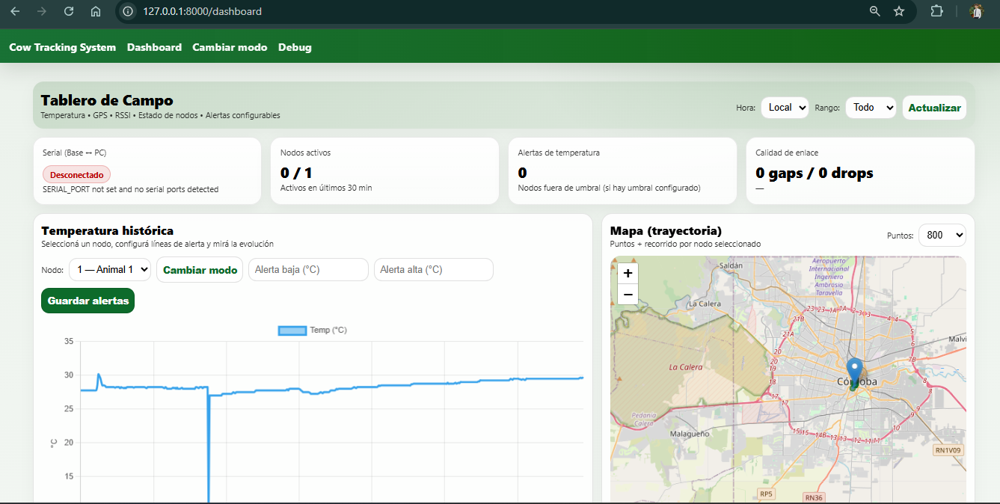
  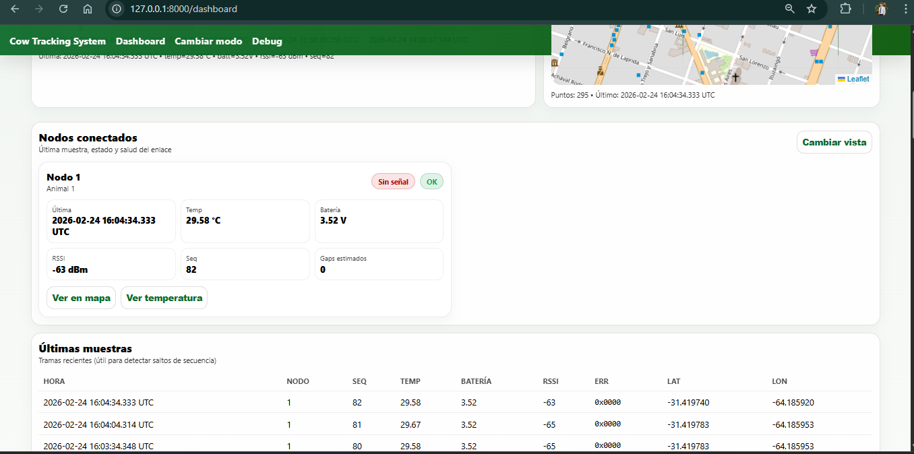
  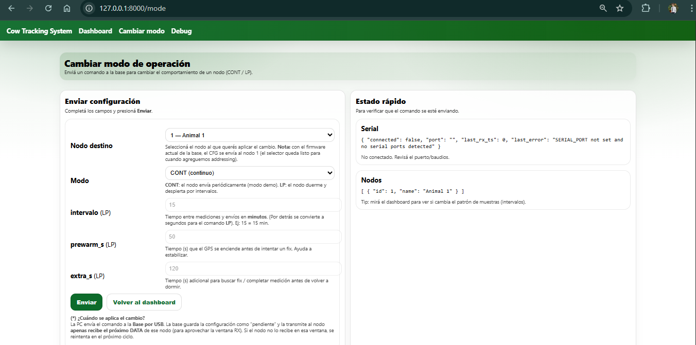
</p>

### Architecture

```
USB Serial (base station)
        │
        ▼
  SerialManager        ← background thread, reads raw frames
        │
        ▼
  Frame Parser         ← unpack header + payload, verify CRC16
        │
        ▼
  SQLite Database      ← stores Node and Frame records (SQLAlchemy)
        │
        ├──► REST API  (/api/...)   ← JSON endpoints
        └──► Web UI    (/dashboard, /debug, /mode)
```

### Components

| Module | Role |
|--------|------|
| `serial/serial_manager.py` | Reads raw bytes from USB CDC serial port in a background thread |
| `proto/frame.py` | Unpacks binary frames, parses DATA payload, converts raw coordinates to decimal degrees |
| `proto/crc16.py` | CRC16-CCITT verification |
| `db/models.py` | `Node` and `Frame` SQLAlchemy ORM models |
| `api/routes.py` | REST endpoints exposing stored telemetry as JSON |
| `web/templates/dashboard.html` | Main live telemetry dashboard |
| `web/templates/debug.html` | Raw frame inspection view |
| `web/templates/mode.html` | Push configuration changes to nodes |

### Frame Deduplication

The tracker can transmit the same frame twice as a redundancy measure. The dashboard app silently deduplicates frames with the same `(node_id, seq)` arriving within a 5-second window before storing them in the database. It also tracks sequence number gaps to detect lost packets.

### Tech Stack

| Library | Version | Purpose |
|---------|---------|---------|
| FastAPI | 0.115.0 | Web framework + REST API |
| Uvicorn | 0.30.6 | ASGI server |
| SQLAlchemy | 2.0.32 | ORM + SQLite session management |
| Pydantic | 2.8.2 | Data validation and schemas |
| pyserial | 3.5 | USB CDC serial communication |
| Jinja2 | 3.1.4 | HTML templating |

### Running the Dashboard

```bash
cd dashboard-app
pip install -r requirements.txt
uvicorn app.main:app --reload
```

Then open `http://localhost:8000/dashboard` in a browser.

The app auto-detects the base station's COM port. If multiple serial ports are available, it can be specified via the `SERIAL_PORT` environment variable:

```bash
SERIAL_PORT=COM3 uvicorn app.main:app --reload
```

---

## Technology Stack Summary

| Layer | Technology |
|-------|-----------|
| Microcontroller | STM32F103C8T6 (ARM Cortex-M3 @ 16 MHz, 64 KB Flash, 20 KB RAM) |
| IDE / Toolchain | STM32CubeIDE + GNU ARM Embedded (arm-none-eabi-gcc) |
| HAL | STM32 HAL (SPI, UART, GPIO, USB Device) |
| Radio | LoRa SX127x (SPI @ 8 Mbit/s) |
| GPS | u-blox NEO6Mv2  (NMEA + UBX, UART @ 9600 baud) |
| Temperature | DS18B20 via OneWire-over-UART (UART @ 115200 baud, half-duplex) |
| PCB Design | KiCad |
| Backend | Python 3, FastAPI, SQLAlchemy, SQLite |
| Frontend |(server-rendered HTML) |

---

## Academic Context

This project was developed as the final deliverable for the **Programación de Sistemas Embebidos** course at **Universidad Católica de Córdoba (UCC)**, Faculty of Engineering. The course focuses on bare-metal and HAL-based programming for ARM Cortex-M microcontrollers, primarily using ST boards (STM32 Blue Pill, STM32 Discovery).

The project was structured as two incremental deliveries:

- **Partial 1** — Initial hardware design and basic sensor + LoRa communication prototype
- **Partial 2** — Full system integration: reliable delivery, operating modes, configuration persistence, and dashboard application

The complete system was presented and demonstrated working as the final exam.

---

## Author

👨‍💻 **Tomás Ossana**

Computer Engineering student — Universidad Católica de Córdoba (UCC), Argentina.

This project was built for educational purposes and puts into practice fundamental concepts acquired throughout the course and the degree, spanning both software and hardware development. 

It was a challenging, integrative, and genuinely enjoyable project from start to finish. Every module integration came with its own set of obstacles, and solving them was just as satisfying as watching the complete system work end to end. I leaned and enjoy a lot during this subjet and that's the most important of all!! 

---
*Universidad Católica de Córdoba — Ingeniería en Computación — 2025*
